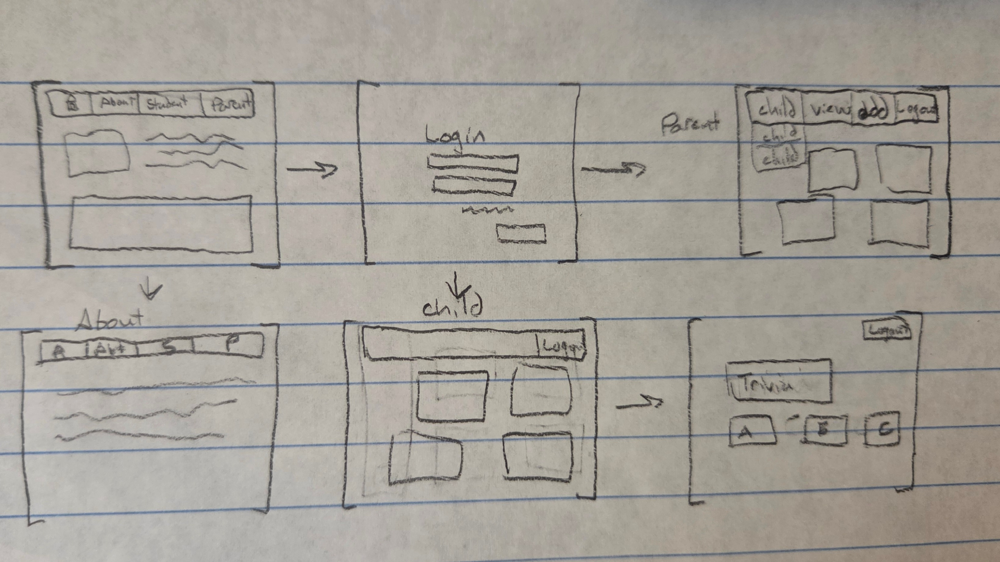

# RAD Education Website
by Keneila Hatch
[My Notes](notes.md)

A supplemental learning software website that provides resources for struggling students to help them learn subjects, when at full capacity. For the purposes of this course, the website will be a mockup of basic navigation, with only a small trivia game for a specific subject available as a resource. This is because I will not have the time to create multiple games and other useful resources. Parents register an account and then add children to it. They recieve updates on their children's work and can access their own resources to help their children. They can navigate between their children, with inividual updates and resources for each. Children, when they are logged in, can pick a subject and use the resources available. 

> [!NOTE]
>  This is a template for your startup application. You must modify this `README.md` file for each phase of your development. You only need to fill in the section for each deliverable when that deliverable is submitted in Canvas. Without completing the section for a deliverable, the TA will not know what to look for when grading your submission. Feel free to add additional information to each deliverable description, but make sure you at least have the list of rubric items and a description of what you did for each item.

> [!NOTE]
>  If you are not familiar with Markdown then you should review the [documentation](https://docs.github.com/en/get-started/writing-on-github/getting-started-with-writing-and-formatting-on-github/basic-writing-and-formatting-syntax) before continuing.

## 🚀 Specification Deliverable

For this deliverable I did the following. I checked the box `[x]` and added a description for things I completed.

- [x] Proper use of Markdown
- [x] A concise and compelling elevator pitch
- [x] Description of key features
- [x] Description of how you will use each technology
- [x] One or more rough sketches of your application. Images must be embedded in this file using Markdown image references.

### Elevator pitch

There are thousands of elementary-school aged children who struggle with school in various ways. RAD education provides resources for those students that are curated for their individual needs, and lets you know how your children are doing and how you can better support their education process. The resources will be developed according to the latest research in child and neurodivergent development, to accomodate a wide range of learning needs, and will be diverse: containing anything from trivia games to dyslexia friendly curriculums. 

### Design

You start on the home page, and can navigate to Register, Student Login, and Parent Login from there. Parents can navigate between their children, and, in the potential future, between updates view and parent resources view. They can register new children to their account. Only one of the course subjects is going to be available for Parents and Children for this class, with the other subjects being labeled as unavailable. The child view will mainly be a mockup where the only two available buttons are logout and a button to play the trivia game. The about page will be really simple, with a similar design to the home page. 

### Key features

- Login, logout, and register
- Parents recieve children's trivia scores, and can add more children to their account
- Trivia game, you answer by selecting one of the multiple choice buttons (updated question from outside source if I can find one)
- A homepage with a description of how the website works (if no trivia question source, an outside sourced picture will be on this page)

### Technologies

I am going to use the required technologies in the following ways.

- **HTML** - 7 different pages - Home page, register, parent login, child login, Parent View, Child View, Trivia Game
- **CSS** - Appealing use of color and space, Easy to understand navigation design, Color telling you which answer was correct
- **React** - Single page application with routing between views, reactive user controls, state hooks
- **Service** - Endpoints for authentication, storing/retrieving scores, storing/retrieving parent or child status, Third party call for trivia questions
- **DB/Login** - Stores authentication, scores, and connected children to parent accounts
- **WebSocket** - Sending parents updates on their children

## 🚀 AWS deliverable

For this deliverable I did the following. I checked the box `[x]` and added a description for things I completed.

- [x] **Server deployed and accessible with custom domain name** - [My server link](https://rad-education.click).

## 🚀 HTML deliverable
Testing
For this deliverable I did the following. I checked the box `[x]` and added a description for things I completed.

- [x] **HTML pages** - 7 seperate pages: Home, Student Login, Parent Login, Register, Parent View, Student View, and Trivia
- [x] **Proper HTML element usage** - used many different elements in an organized structure and with intent
- [x] **Links** - Links to every page and to the github
- [x] **Text** - The home page especially has a lot of text on it, but most pages have something
- [x] **3rd party API placeholder** - Either the trivia game or the images in the home page will be third party calls
- [x] **Images** - Two images on the home page
- [x] **Login placeholder** - Three login pages, each for a different purpose.
- [x] **DB data placeholder** - The various logins, amount of children under a parent, and the trivia scores are going to be database applications
- [x] **WebSocket placeholder** - The parent gets updates about a child's score on their page.

## 🚀 CSS deliverable

For this deliverable I did the following. I checked the box `[x]` and added a description for things I completed.

- [ ] **Header, footer, and main content body** - I did not complete this part of the deliverable.
- [ ] **Navigation elements** - I did not complete this part of the deliverable.
- [ ] **Responsive to window resizing** - I did not complete this part of the deliverable.
- [ ] **Application elements** - I did not complete this part of the deliverable.
- [ ] **Application text content** - I did not complete this part of the deliverable.
- [ ] **Application images** - I did not complete this part of the deliverable.

## 🚀 React part 1: Routing deliverable

For this deliverable I did the following. I checked the box `[x]` and added a description for things I completed.

- [ ] **Bundled using Vite** - I did not complete this part of the deliverable.
- [ ] **Components** - I did not complete this part of the deliverable.
- [ ] **Router** - I did not complete this part of the deliverable.

## 🚀 React part 2: Reactivity deliverable

For this deliverable I did the following. I checked the box `[x]` and added a description for things I completed.

- [ ] **All functionality implemented or mocked out** - I did not complete this part of the deliverable.
- [ ] **Hooks** - I did not complete this part of the deliverable.

## 🚀 Service deliverable

For this deliverable I did the following. I checked the box `[x]` and added a description for things I completed.

- [ ] **Node.js/Express HTTP service** - I did not complete this part of the deliverable.
- [ ] **Static middleware for frontend** - I did not complete this part of the deliverable.
- [ ] **Calls to third party endpoints** - I did not complete this part of the deliverable.
- [ ] **Backend service endpoints** - I did not complete this part of the deliverable.
- [ ] **Frontend calls service endpoints** - I did not complete this part of the deliverable.
- [ ] **Supports registration, login, logout, and restricted endpoint** - I did not complete this part of the deliverable.

## 🚀 DB deliverable

For this deliverable I did the following. I checked the box `[x]` and added a description for things I completed.

- [ ] **Stores data in MongoDB** - I did not complete this part of the deliverable.
- [ ] **Stores credentials in MongoDB** - I did not complete this part of the deliverable.

## 🚀 WebSocket deliverable

For this deliverable I did the following. I checked the box `[x]` and added a description for things I completed.

- [ ] **Backend listens for WebSocket connection** - I did not complete this part of the deliverable.
- [ ] **Frontend makes WebSocket connection** - I did not complete this part of the deliverable.
- [ ] **Data sent over WebSocket connection** - I did not complete this part of the deliverable.
- [ ] **WebSocket data displayed** - I did not complete this part of the deliverable.
- [ ] **Application is fully functional** - I did not complete this part of the deliverable.
